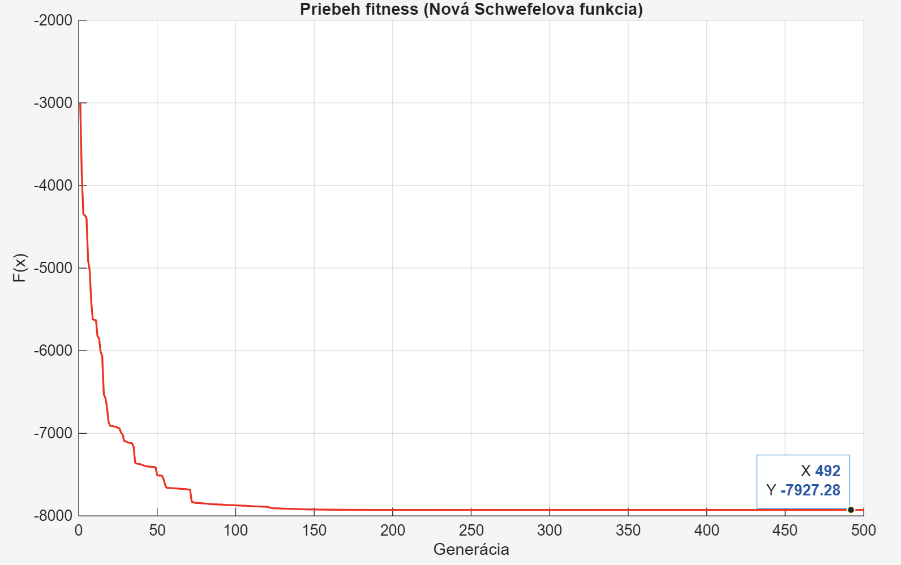
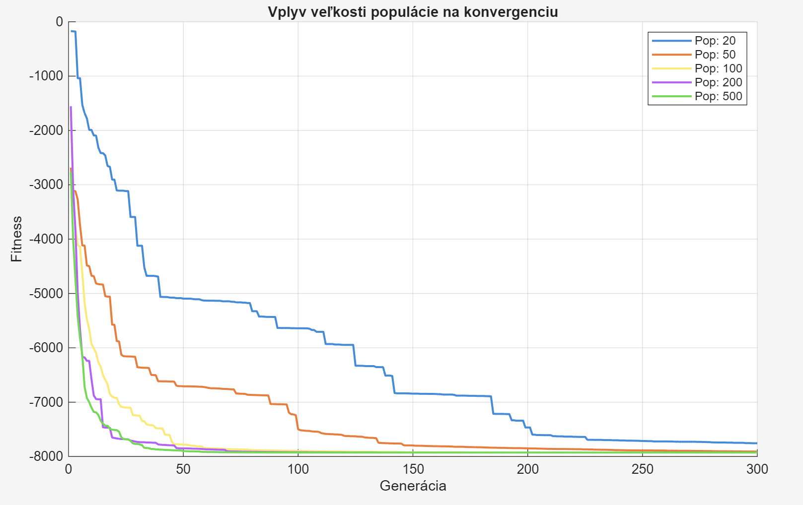
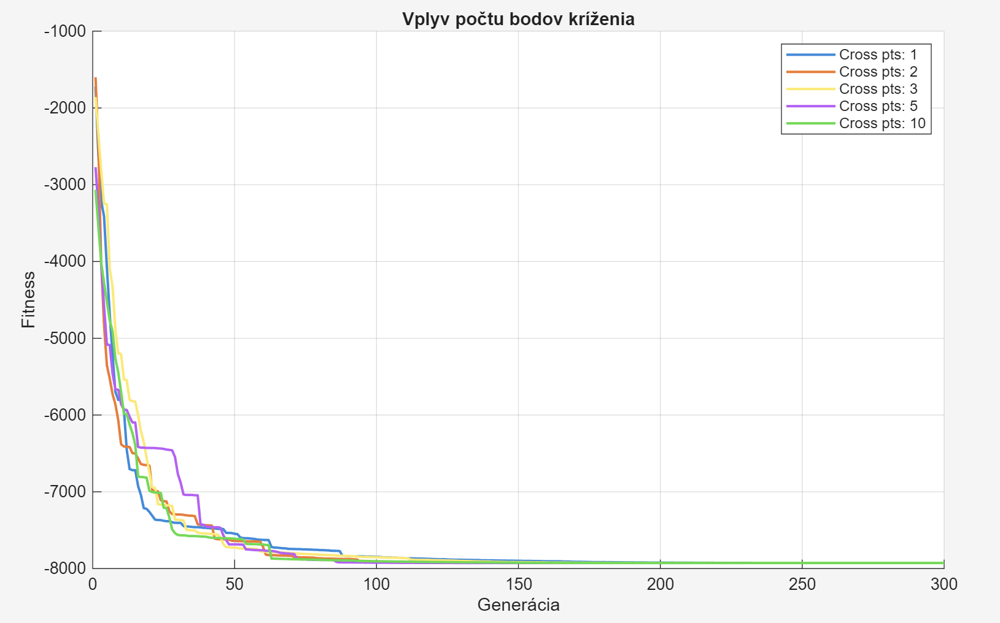
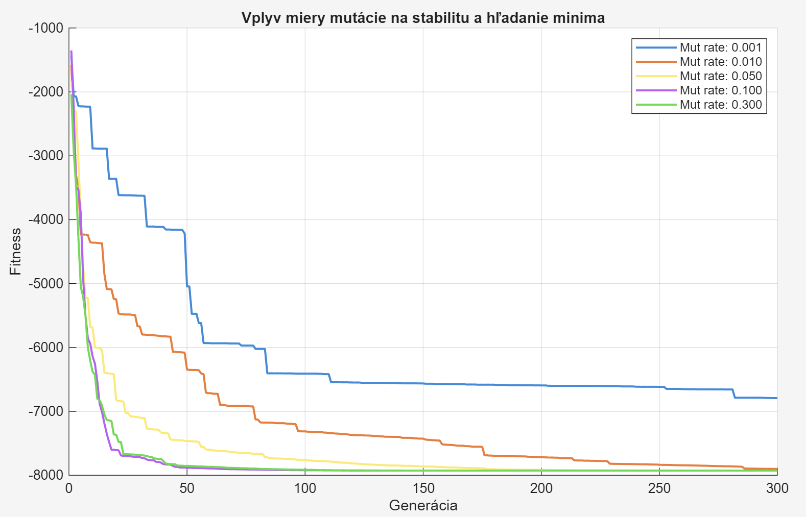
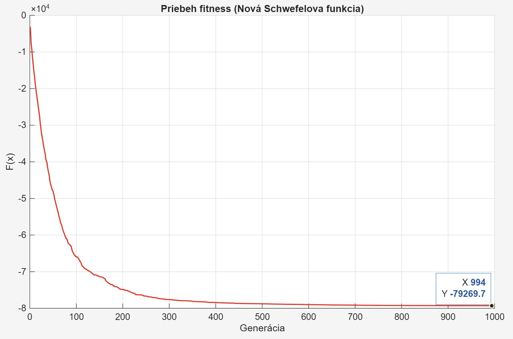
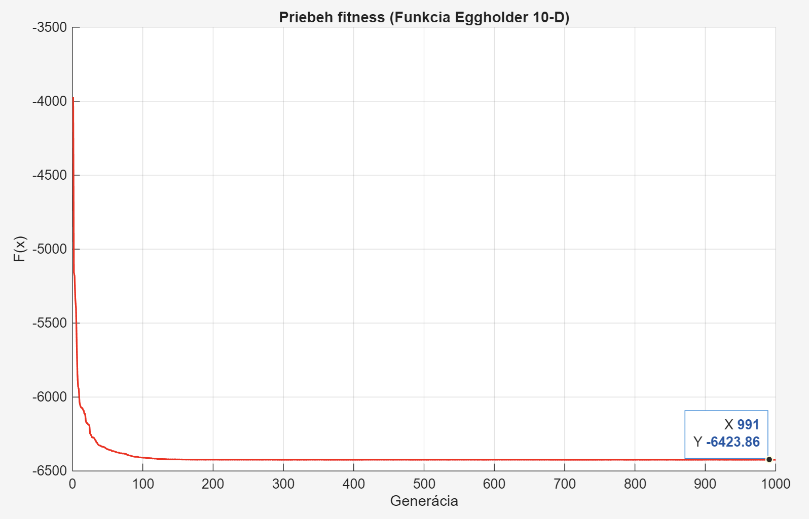

# Optimalizacia Schwefelovej funkcie pomocou Genetickeho Algoritmu

Tento subor popisuje implementaciu a analyzu genetickeho algoritmu (GA) v prostredi MATLAB pre riesenie 10-dimenzionalnej optimalizacnej ulohy (Schwefelova funkcia `testfn3c`). Cielom bolo najst globalne minimum v priestore [-1000, 1000]^D.

---

## Hlavny Optimalizacny Algoritmus

Konfiguracia algoritmu, ktora preukazala najlepsiu schopnost konvergovat k teoretickemu minimu.

### Klucove parametre:
* **Dimenzia (D)**: 10
* **Populacia**: 100 jedincov
* **Generacie**: 500
* **Selekcia**: Elitarstvo (9 najlepsich) + SUS (91 zvysnych)
* **Krizenie**: 3-bodove
* **Mutacia**: Kombinovana (X-mutacia + Aditivna mutacia) s mierou 5 %

---

## Popis pouzitych funkcii

| Funkcia | Vyznam a uloha v algoritme |
| :--- | :--- |
| `genrpop` | **Generovanie populacie**: Vytvori maticu nahodnych jedincov v definovanom priestore SPACE_A. |
| `testfn3c` | **Fitness funkcia**: Schwefelova funkcia, ktora priraduje kazdemu jedincovi skore (kvalitu riesenia). |
| `selbest` | **Elitarstvo**: Vyberie N najlepsich jedincov a skopiruje ich priamo do dalsej generacie bez zmien. |
| `selsus` | **Stochasticke univerzalne vzorkovanie**: Vyber rodicov, kde sancu maju aj slabsi jedinci, co udrzuje diverzitu. |
| `crossov` | **Krizenie (Crossover)**: Skombinuje geneticku informaciu dvoch rodicov pomocou viacbodoveho krizenia. |
| `mutx` | **X-mutacia**: Nahodne meni hodnoty v chromozome na uplne nove hodnoty z povoleneho rozsahu. |
| `muta` | **Aditivna mutacia**: Pridava malu nahodnu hodnotu k existujucim genom pre lokalne ladenie. |
| `selrand` | **Nahodny vyber**: Vyberie nahodnych jedincov z populacie pre zachovanie genetickej rozmanitosti. |
| `seldiv` | **Selekcia podla diverzity**: Vybera jedincov tak, aby sa zachovala co najvacsia rozmanitost v populacii. |
| `change` | **Migracia/Zmena**: Nahradi cast populacie novymi nahodnymi jedincami na zabranenie uviaznutia v lokalnom minime. |

---

## Multirun Experimenty (Analyza parametrov)

V ramci experimentov bol vzdy meneny len jeden parameter, zatial co ostatne zostali fixne na bazalnych hodnotach.

### 1. Vplyv velkosti populacie

* Vacsia populacia (200+) nachadza minimum rychlejsie a s mensim rizikom uviaznutia v lokalnom minime.
* Populacia s 20 jedincami je pre 10-D problem nedostatocna a vykazuje vysoku mieru predcasnej konvergencie.

### 2. Vplyv poctu bodov krizenia

* Pocet bodov krizenia ma na Schwefelovu funkciu mierny vplyv.
* 3-bodove a 5-bodove krizenie vykazuje optimalny balans medzi miesanim informacie a udrzanim kvalitnych blokov genov.

### 3. Vplyv miery mutacie

* Prilis nizka mutacia (0.001) vedie k stagnacii a uviaznutiu v lokalnom minime.
* Extremne vysoka mutacia (0.3) meni algoritmus na nahodne hladanie, co znemoznuje presne usadenie sa v globalnom minime.
* Idealna miera sa pohybuje v rozmedzi 1 % az 5 %.

---

## Bonusy

### Bonus A: Vysoka dimenzionalita (100-D)

Testovanie algoritmu na Schwefelovej funkcii pri masivnom zvyseni dimenzie na **D = 100**.
* **Konfiguracia**: Populacia 300, 1000 generacii, 9-bodove krizenie.
* **Ciel**: Overenie skalovatelnosti algoritmu a schopnosti najst riesenie v extremne velkom vyhladavacom priestore.

### Bonus B: Optimalizacia funkcie Eggholder (10-D)

Aplikacia GA na znamu benchmarkovu funkciu **Eggholder**, ktora je charakteristicka velkym poctom ostrych lokalnych minim.
* **Konfiguracia**: Populacia 300, vyuzitie `seldiv` (diverzita), `selrand` a funkcie `change` pre maximalnu exploraciu priestoru.
* **Ciel**: Prekonanie problemu uviaznutia v lokalnych minimach, ktore su pre tuto funkciu typicke.