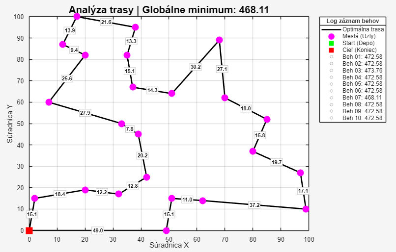
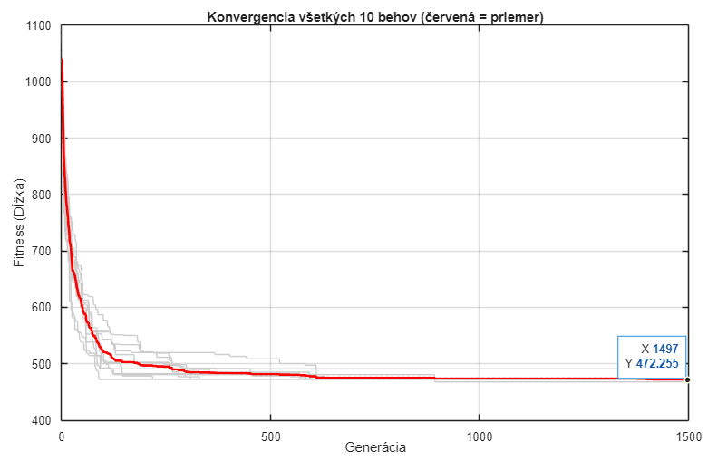
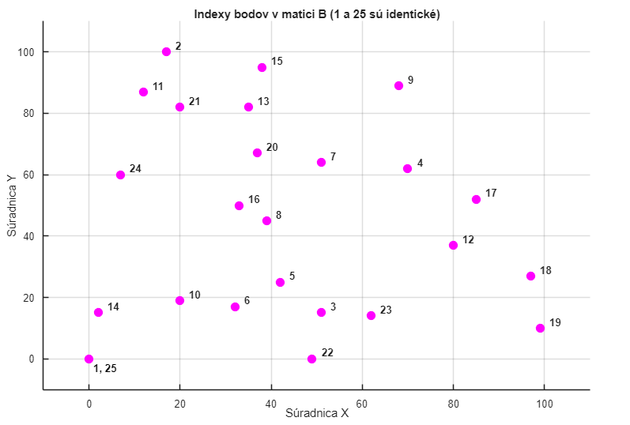

# Optimalizácia problému obchodného cestujúceho (TSP) pomocou GA

Tento projekt implementuje genetický algoritmus (GA) v prostredí MATLAB na riešenie problému obchodného cestujúceho pre 25 statických bodov. Cieľom je nájsť najkratšiu možnú trajektóriu so začiatkom v bode 1 a koncom v bode 25.

## 1. Cieľ úlohy
Navrhnúť GA pre výpočet najkratšej dráhy robota, ktorý začína v bode $[0,0]$, navštívi všetky definované body a vráti sa späť do bodu $[0,0]$.
* **Referenčná kontrolná hodnota:** 468.1095
* **Dosiahnutá hodnota:** **468.11**

## 2. Kódovanie riešenia
Riešenie je kódované ako chromozóm pozostávajúci z **indexov bodov** (celočíselná permutácia). 
* **Fixné body:** Prvý gén (index 1) a posledný gén (index 25) sú fixne nastavené na bod $[0,0]$. To zaručuje, že trasa vždy začína a končí v depe.
* **Permutačné jadro:** Algoritmus optimalizuje poradie vnútornej sekvencie bodov, t.j. **indexy 2 až 24**.

## 3. Podrobný popis použitých funkcií

V kóde sú použité nasledujúce funkcie, ktoré zabezpečujú inicializáciu, evolúciu a výpočet úspešnosti:

### A. Inicializačné a matematické funkcie
* **`randperm(n)`**: Funkcia generuje náhodnú permutáciu čísel od $1$ do $n$ bez opakovania. V kóde sme ju použili na vytvorenie náhodného poradia miest medzi štartom a cieľom: `randperm(numPoints - 2) + 1`. Týmto sme zabezpečili, že každý bod (okrem fixných) bude navštívený práve raz.
* **`sqrt(sum((p1 - p2).^2))`**: Implementácia Euklidovskej vzdialenosti medzi dvoma bodmi $p_1$ a $p_2$. Slúži na výpočet dĺžky úseku medzi mestami.

### B. Selekčné funkcie (Toolbox)
* **`selbest(Chrom, ObjV, [n n n])`**: Funkcia elitárnej selekcie. Zabezpečuje, aby sa najlepší jedinci z aktuálnej generácie bez zmeny preniesli do ďalšej. Tým sa zabráni strate doteraz najlepšieho nájdeného riešenia.
* **`seltourn(Chrom, ObjV, n)`**: Turnajová selekcia. Náhodne vyberie skupinu jedincov a z nich vyberie najlepšieho. Tento mechanizmus pomáha udržiavať populáciu v pohybe a bráni predčasnej konvergencii.

### C. Permutačné genetické operátory (Toolbox)
Pre TSP je nevyhnutné použiť operátory, ktoré zachovávajú unikátnosť indexov (permutáciu):
* **`crosord` (Order Crossover)**: Kríženie určené pre poradové problémy. Preberie časť sekvencie od jedného rodiča a zvyšok doplní z druhého tak, aby nedošlo k duplicite miest.

* **`swappart`**: Mutácia, ktorá náhodne vymení dva body (gény) v chromozóme.
* **`invord` (Inversion)**: Náhodne vyberie úsek trasy a prevráti jeho poradie. Tento operátor je kľúčový pre TSP, pretože dokáže efektívne "rozmotať" prekrížené čiary v grafe.
* **`swapgen`**: Vykonáva náhodnú výmenu génov v rámci populácie, čím zvyšuje šancu na objavenie nových kombinácií.

## 4. Fitness funkcia
Fitness funkcia je definovaná ako **celková dĺžka dráhy**. Výpočet prebieha v cykle ako suma vzdialeností medzi nasledujúcimi bodmi v chromozóme. Keďže ide o minimalizačný problém, čím je hodnota fitness nižšia, tým je riešenie lepšie.

## 5. Experimentálne nastavenia
* **Veľkosť populácie:** 200 jedincov
* **Počet generácií:** 1500
* **Mutácia:** Rozsah mutácie bol obmedzený na indexy `2:numPoints-1` (2 až 24), aby nedošlo k zmene fixného štartu a cieľa.

## 6. Vyhodnotenie 10 behov
Algoritmus bol spustený 10-krát pre overenie stability.
```
┌──────────────────────────────────────────────────┐
│     SYSTÉM PRE GENETICKÚ OPTIMALIZÁCIU TRASY     │
├──────────────────────────────────────────────────┤
│ Nastavenia:  10 behov | 1500 generácií | Pop: 200│
├───────────┬──────────────────┬───────────────────┤
│  ID Behu  │   Stav Procesu   │ Najlepšia Fitness │
├───────────┼──────────────────┼───────────────────┤
│    01     │    Spracúvam...  │        472.58     │
│    02     │    Spracúvam...  │        472.58     │
│    03     │    Spracúvam...  │        473.76     │
│    04     │    Spracúvam...  │        472.58     │
│    05     │    Spracúvam...  │        472.58     │
│    06     │    Spracúvam...  │        472.58     │
│    07     │    Spracúvam...  │        468.11     │
│    08     │    Spracúvam...  │        472.58     │
│    09     │    Spracúvam...  │        472.58     │
│    10     │    Spracúvam...  │        472.58     │
├───────────┴──────────────────┴───────────────────┤
│         FINÁLNE ŠTATISTICKÉ VYHODNOTENIE         │
├──────────────────────────────────────┬───────────┤
│ Absolútne globálne minimum           │    468.11 │
│ Priemerná hodnota fitness            │    472.25 │
│ Celková úspešnosť riešení (pod 480)  │     100 % │
└──────────────────────────────────────┴───────────┘
```
**Štatistický záver:** 100 % behov dosiahlo hodnotu $\leq 480$, čím bola podmienka úspešnosti (min. 50 %) splnená.

## 7. Vizualizácia

### Priebeh fitness (Konvergencia)

*Graf zobrazuje vývoj fitness pre všetkých 10 behov a ich priemernú krivku (červená).*


### Najlepšia nájdená dráha (Fitness: 468.11)


*Vykreslenie optimálnej trajektórie. Štart (zelený štvorec) a cieľ (červený štvorec) sú v bode [0,0].*



*Vykreslenie konvergencie všetkých 10 behov a ich priemer*

### Najlepší nájdený genóm


Genóm pre hodnotu 468.11:
```matlab

     [1, 22, 3, 23, 19, 18, 12, 17, 4, 9, 7, 20, 13, 15, 2, 11, 21, 24, 16, 8, 5, 6, 10, 14, 25]

```
