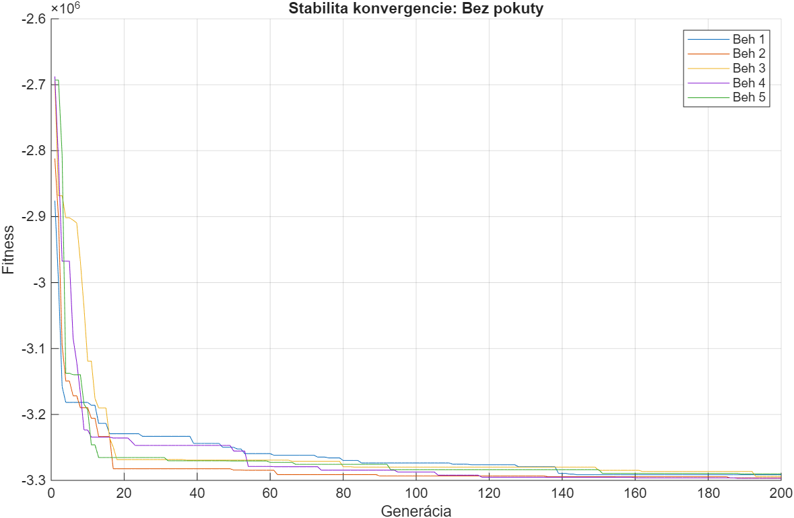
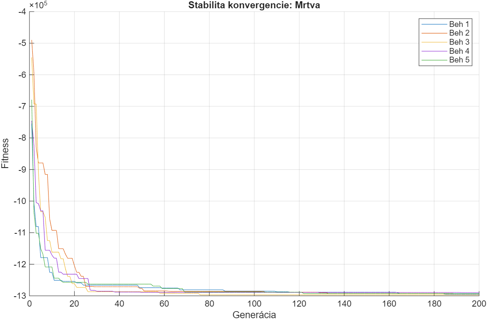
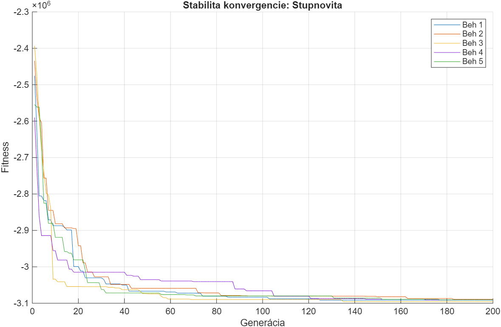
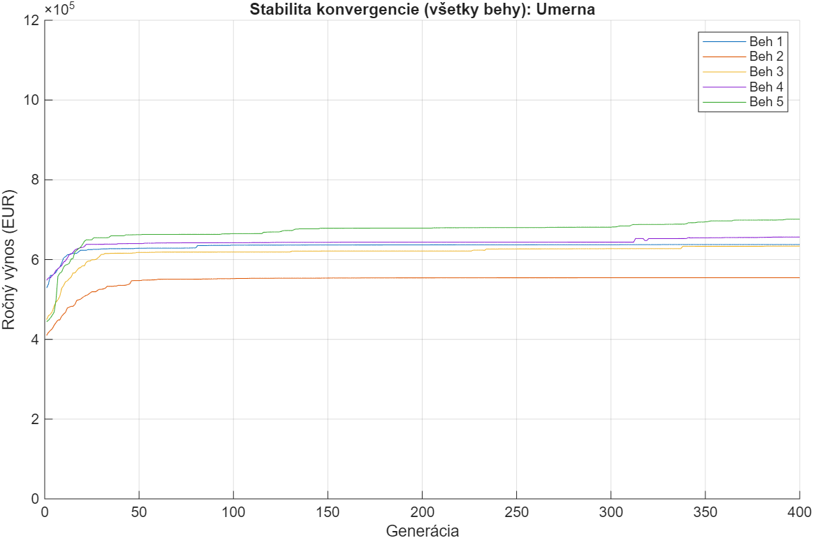
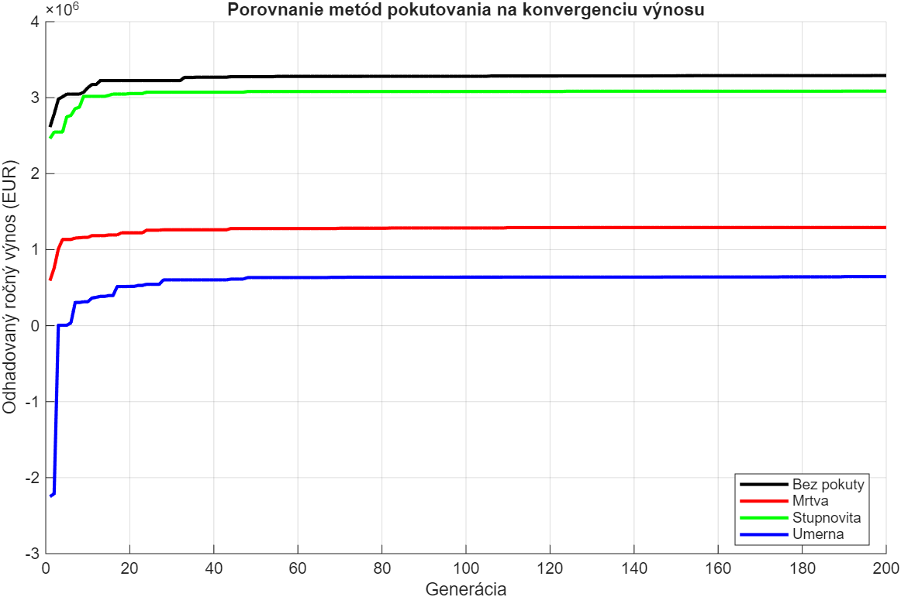

# Optimalizácia investičného portfólia pomocou GA (Zadanie 4)

Tento projekt implementuje genetický algoritmus (GA) na riešenie úlohy optimálneho rozdelenia investičného kapitálu v hodnote **10 000 000 EUR**. Cieľom je porovnať vplyv rôznych penalizačných prístupov na stabilitu riešenia a schopnosť algoritmu dodržať stanovené finančné ohraničenia.

---

## Postup riešenia (v súlade s bodmi zadania)

### 1. Konfigurácia a kódovanie (Bod 1 a 2)
Riešenie je kódované ako chromozóm s reálnymi číslami o dĺžke $D = 5$. Fitness funkcia je nastavená na minimalizáciu záporného výnosu (maximalizácia zisku):
$$Fitness = - (0.04x_1 + 0.07x_2 + 0.11x_3 + 0.06x_4 + 0.05x_5) + Pokuta$$

### 2. Metódy pokutovania (Bod 3)
Porovnávame štyri prístupy k riešeniu neprípustných jedincov:
- **Bez pokuty:** Referenčný beh bez obmedzení.
- **Mŕtva pokuta:** Fixná sankcia za akékoľvek porušenie ohraničení.
- **Stupňovitá pokuta:** Penalizácia rastie lineárne s počtom porušených pravidiel.
- **Úmerná pokuta:** Sankcia rastiaca s konkrétnou mierou porušenia limitov.

### 3. Stabilita konvergencie (Bod 4)
Pre každú metódu bolo vykonaných **5 nezávislých behov**. Nižšie sú zobrazené priebehy konvergencie pre jednotlivé prístupy, ktoré dokumentujú stabilitu algoritmu:

| Metóda: Bez pokuty | Metóda: Mŕtva pokuta |
| :---: | :---: |
|  |  |

| Metóda: Stupňovitá pokuta | Metóda: Úmerná pokuta |
| :---: | :---: |
|  |  |

### 4. Porovnanie konvergencie (Bod 6)
Finálne porovnanie najlepších priebehov všetkých štyroch metód v jednom grafe:

---

## Archivácia výsledkov (Bod 5 a 7)

Na základe vykonaných experimentov boli namerané nasledujúce finálne hodnoty najlepších jedincov:

#### **A. Metóda: Bez pokuty**
- **Optimálna alokácia x:** `[9988980, 9996684, 9992348, 9991254, 9989620] EUR`
- **Kontrola ohraničení (v):** `[39958886.83, 17485664.14, 0.00, 0.00]`
- *Poznámka: Podľa očakávania investuje maximum do všetkých produktov bez ohľadu na limity.*

#### **B. Metóda: Mŕtva pokuta**
- **Optimálna alokácia x:** `[9956558, 9997138, 9999429, 9994393, 9999139] EUR`
- **Kontrola ohraničení (v):** `[39946656.37, 17453696.19, 4746.08, 0.00]`
- *Poznámka: Algoritmus pri zvolenej konštante nedokázal nájsť prípustnú oblasť.*

#### **C. Metóda: Stupňovitá pokuta**
- **Optimálna alokácia x:** `[9999679, 9979588, 9988465, 9996697, 9994745] EUR`
- **Kontrola ohraničení (v):** `[39959174.30, 17479266.59, 0.00, 0.00]`

#### **D. Metóda: Úmerná pokuta**
- **Optimálna alokácia x:** `[234538, 2265066, 2277336, 2665241, 2501203] EUR`
- **Kontrola ohraničení (v):** `[0.00, 0.00, 0.00, 0.00]`
- *Poznámka: Jediná metóda, ktorá úspešne našla plne legálne a stabilné riešenie.*

