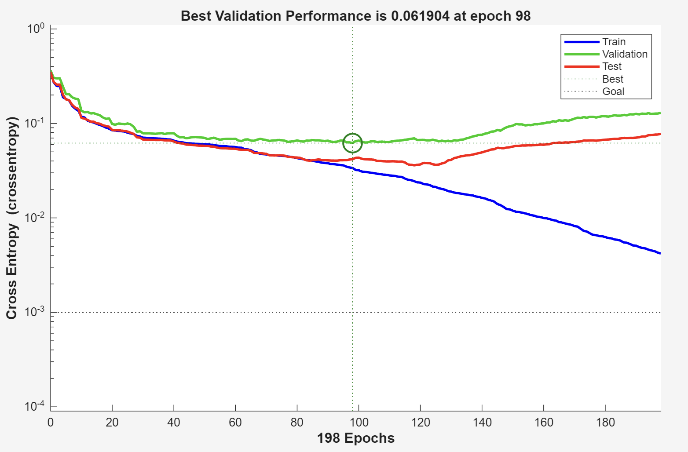
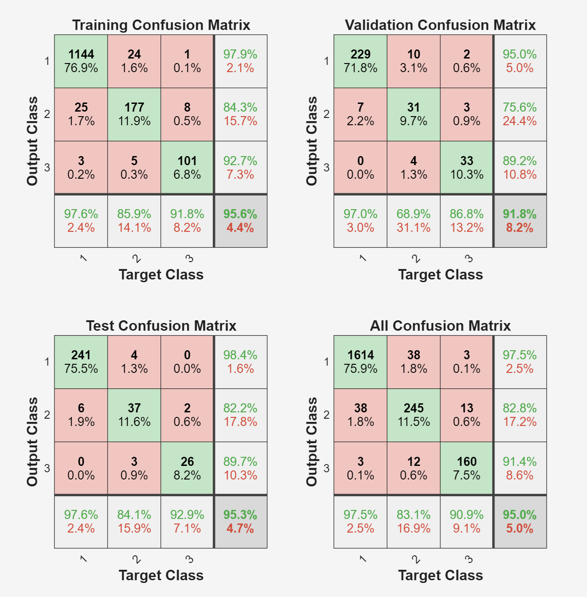
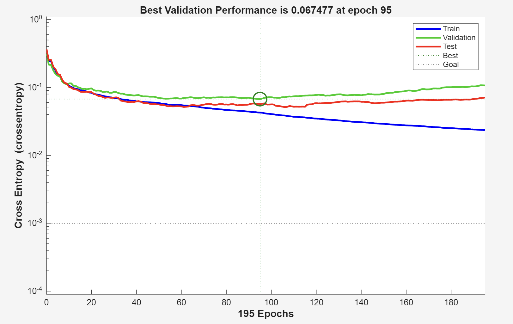
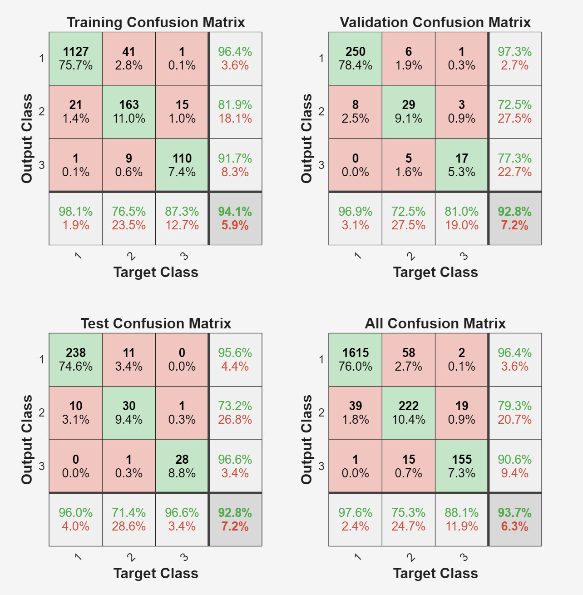
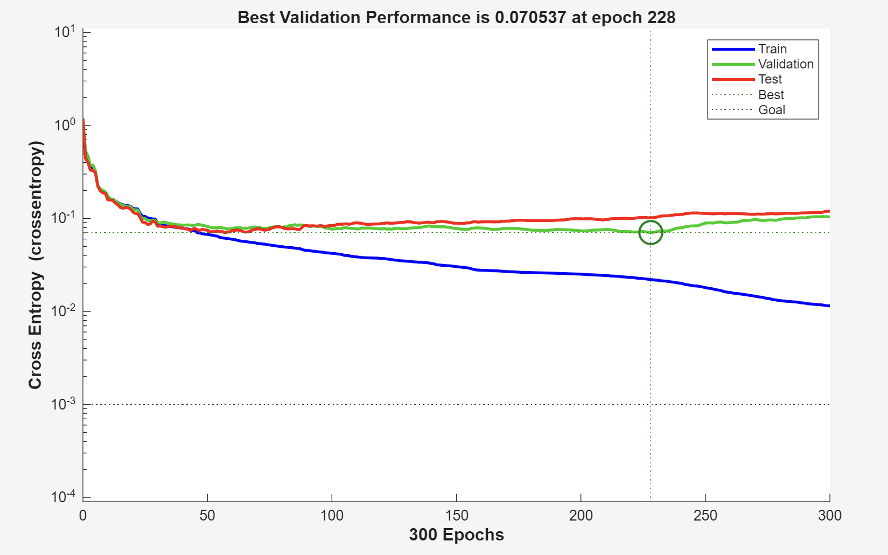
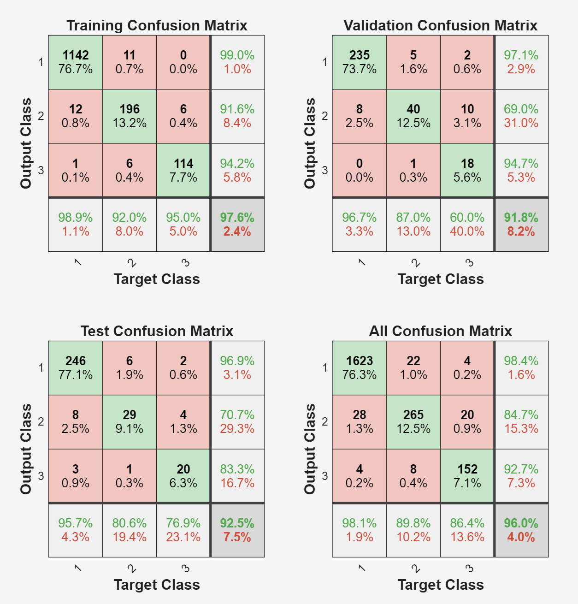

# Dokumentácia: Klasifikácia medicínskych dát pomocou MLP (Zadanie č. 6)

Tento projekt implementuje viacvrstvovú perceptrónovú neurónovú sieť (MLP) na klasifikáciu stavu plodu na základe CTG (kardiotokografia) vyšetrenia. Cieľom je dosiahnuť priemernú úspešnosť nad 92 %.

## 1. Definícia úlohy a spracovanie dát
Úlohou je klasifikácia do 3 tried:
1. **Normálny** (Normal)
2. **Podozrivý** (Suspect)
3. **Patologický** (Pathologic)

### Informácie o datasete:
* **Rozsah:** 2126 záznamov, každý opísaný 25 parametrami.
* **Delenie dát:** Manuálne rozdelenie so stratifikáciou (zachovanie pomeru tried):
    * **Tréningová množina:** 60 %
    * **Validačná množina:** 20 %
    * **Testovacia množina:** 20 %

## 2. Architektúry sietí a hyperparametre
Všetky modely zdieľajú rovnaké nastavenia trénovania pre zabezpečenie objektívneho porovnania:
* **Epochy:** 300
* **Goal (Cieľová chyba):** 0.001
* **Max Fail (Early Stopping):** 100
* **Trénovací algoritmus:** `trainlm` (Levenberg-Marquardt)

| Model | Počet skrytých vrstiev | Počet neurónov |
| :--- | :---: | :--- |
| **M1** | 1 | 25 |
| **M2** | 1 | 10 |
| **M3** | 2 | 20, 10 |

---

## 3. Výsledky meraní (Tabuľky)
Každý model bol spustený 5-krát, aby sa eliminoval vplyv náhodnej inicializácie váh.

### Súhrnné porovnanie modelov
| Model | Min Test Acc [%] | Max Test Acc [%] | Priemer Test Acc [%] | Priemer Test Loss |
| :--- | :---: | :---: | :---: | :---: |
| **M1** | 93.90 | 96.24 | **95.02** | 0.0727 |
| **M2** | 92.72 | 96.48 | 94.37 | 0.0769 |
| **M3** | 92.02 | 95.31 | 93.71 | 0.0687 |

---

## 4. Vizualizácia a grafické výstupy - LEN JEDEN BEH PRE KAŽDÉ

### Model M1
**Priebeh učenia (Performance):**

*Tento graf zobrazuje priebeh učenia (Performance) tvojej neurónovej siete vyjadrený pomocou krížovej entrópie (Cross Entropy) v závislosti od počtu epoch.*

**Matica zámien (Confusion Matrix):**

*Zelené polia na diagonále indikujú správne zatriedenie vzoriek.*

### Model M2

*Tento graf zobrazuje priebeh učenia (Performance) tvojej neurónovej siete vyjadrený pomocou krížovej entrópie (Cross Entropy) v závislosti od počtu epoch.*

**Matica zámien:**

### Model M3

*Tento graf zobrazuje priebeh učenia (Performance) tvojej neurónovej siete vyjadrený pomocou krížovej entrópie (Cross Entropy) v závislosti od počtu epoch.*

**Matica zámien:**

---

## 5. Analýza metrík pre najlepšiu sieť
Pre medicínske účely sme vyhodnotili úspešnosť pre **Triedu 3 (Patologický stav)**:

* **Celková úspešnosť (Accuracy):** 95.31 %
* **Senzitivita (TPR):** 88.89 % (Schopnosť zachytiť skutočne chorých)
* **Špecificita (TNR):** 99.23 % (Schopnosť správne určiť zdravých)

### Použité vzorce:
Pre výpočet sme využili hodnoty z matice zámien: **TP** (True Positive), **TN** (True Negative), **FP** (False Positive) a **FN** (False Negative).

$$Accuracy = \frac{TP + TN}{TP + TN + FP + FN}$$
$$Sensitivity = \frac{TP}{TP + FN}$$
$$Specificity = \frac{TN}{TN + FP}$$

### Podrobný rozklad výpočtu:

1. **TP = cm(3,3); (True Positive)**
   * **Logika:** Výber hodnoty v 3. riadku (skutočná trieda) a 3. stĺpci (predikovaná trieda).
   * **Význam:** Počet bábätiek, ktoré boli **skutočne patologické** a sieť ich správne identifikovala.

2. **FP = sum(cm(:,3)) - TP; (False Positive)**
   * **Logika:** Súčet celého 3. stĺpca (všetko, čo sieť označila ako Triedu 3) mínus správne zásahy (TP).
   * **Význam:** Počet bábätiek, ktoré sieť označila za patologické, ale v skutočnosti boli **zdravé alebo podozrivé**. Ide o tzv. "falošný poplach".

3. **FN = sum(cm(3,:)) - TP; (False Negative)**
   * **Logika:** Súčet celého 3. riadku (všetky skutočne patologické prípady) mínus tie, ktoré sieť trafila (TP).
   * **Význam:** Počet bábätiek s patológiou, ktoré sieť **prehliadla** a označila za zdravé. V medicíne je toto najkritickejšia chyba.

4. **TN = sum(cm(:)) - (TP + FP + FN); (True Negative)**
   * **Logika:** Od celkového počtu vzoriek sa odpočíta všetko, čo sa týka Triedy 3 (správne aj nesprávne určenia).
   * **Význam:** Počet bábätiek, ktoré **nie sú patologické** a sieť ich aj správne určila ako nepatologické.

## 6. Zhodnotenie
Všetky tri testované modely splnili limit 92 %. Model **M1** s jednou skrytou vrstvou a 25 neurónmi sa ukázal ako najvhodnejší z pohľadu priemernej presnosti. Vysoká špecificita modelu minimalizuje riziko falošne pozitívnych nálezov, čo je kľúčové pre technickú integritu diagnostického systému.