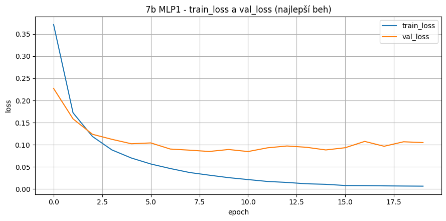
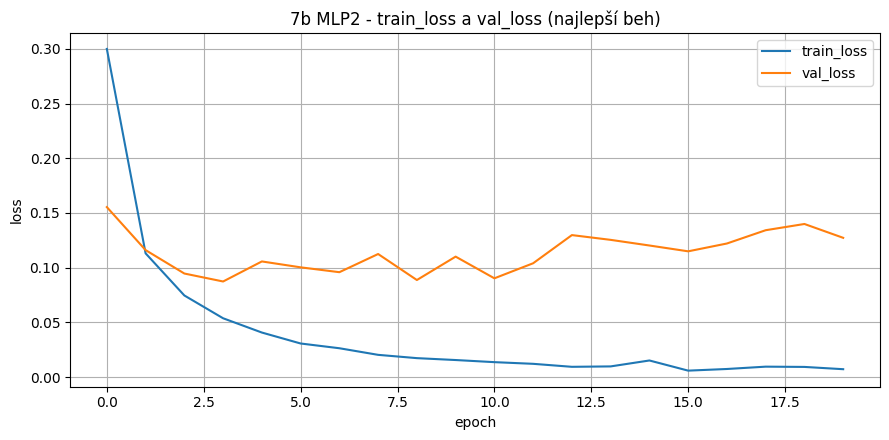
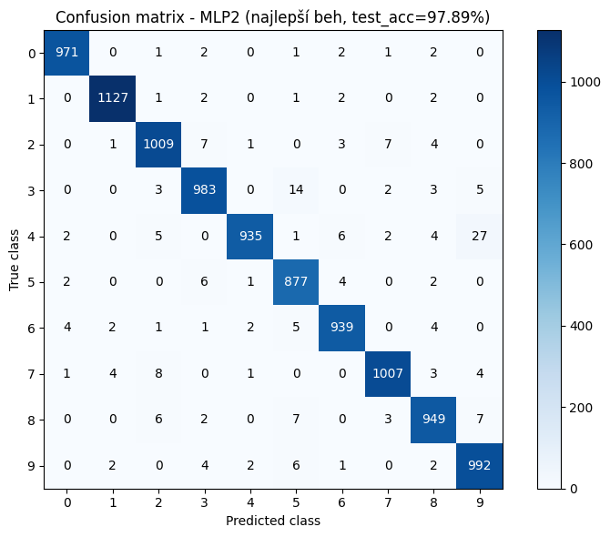
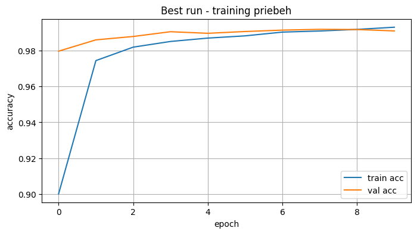
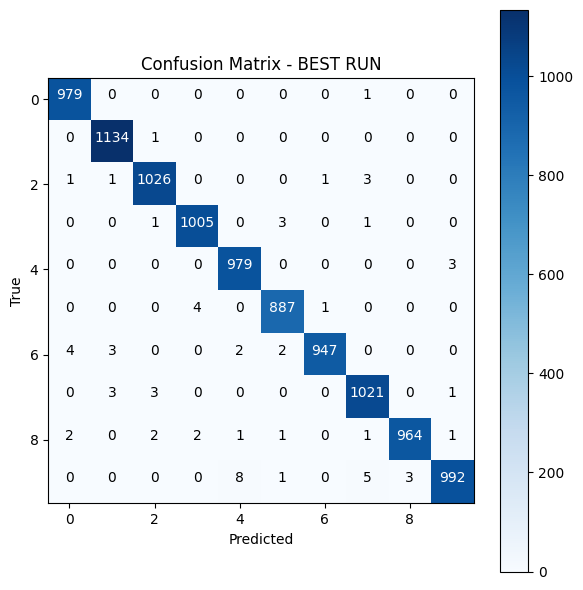
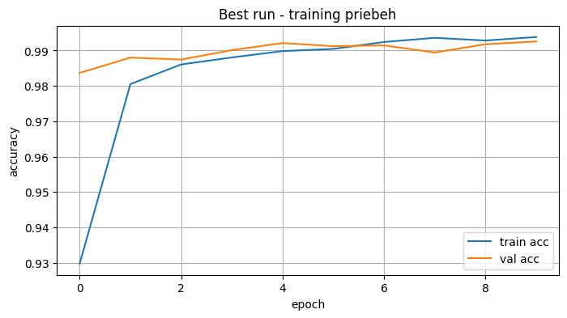
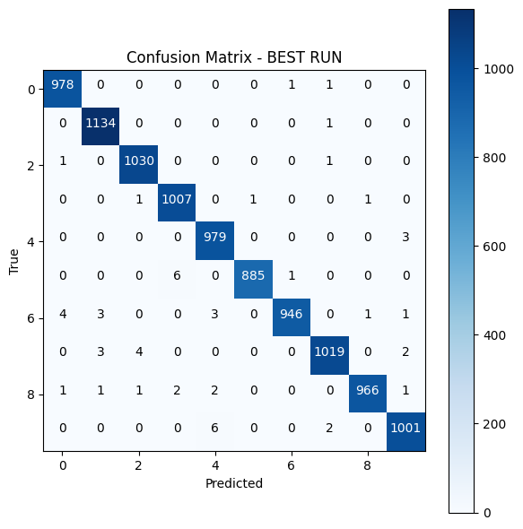
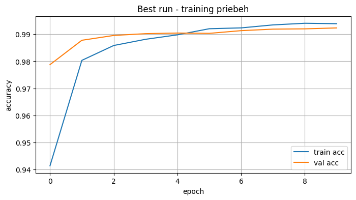
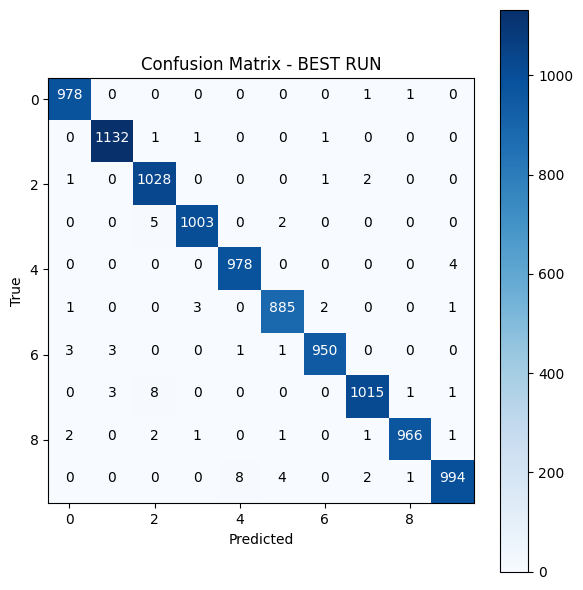
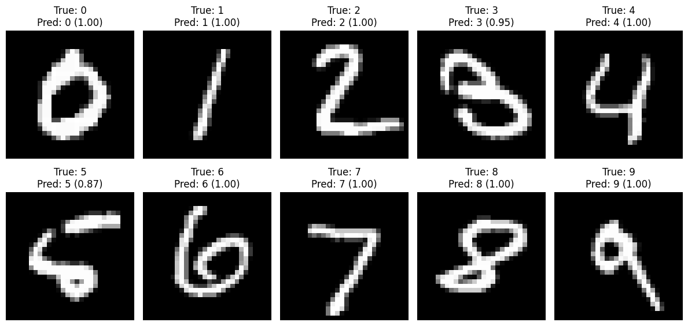

# Klasifikácia číslic MNIST: Komplexné porovnanie architektúr a optimalizácie

Tento projekt dokumentuje vývoj, trénovanie a detailné porovnanie rôznych architektúr neurónových sietí pre rozpoznávanie rukou písaných číslic. Prešli sme od baseline modelov plne prepojených sietí (MLP) k pokročilým konvolučným sieťam (CNN), pričom sme analyzovali vplyv **regularizácie (Dropout)** a **hardvérovej akcelerácie (GPU/CUDA)**.

---

## 1. Viacvrstvový Perceptrón (MLP)

Ako základný baseline sme implementovali dve architektúry plne prepojených sietí bez regularizácie.

### Architektúry a hyperparametre
| Model | Skryté vrstvy | Neuróny | Epochy | LR | Batch |
| :--- | :---: | :---: | :---: | :---: | :---: |
| **MLP1** | 1 | 128 | 20 | 0.001 | 64 |
| **MLP2** | 2 | 256, 128 | 20 | 0.001 | 64 |

### Súhrnné výsledky MLP
| Model | Min Test Acc [%] | Max Test Acc [%] | Priemer Test Acc [%] | Priemer Test Loss |
| :--- | :---: | :---: | :---: | :---: |
| **MLP1** | 97.65 | 97.83 | 97.72 | 0.0990 |
| **MLP2** | 97.57 | 97.89 | 97.67 | 0.1277 |

**Vizualizácia pre MLP1:**
*
*

**Vizualizácia pre MLP2:**
*
*

**Pozorovanie:** MLP modely dosahujú vysokú presnosť, ale vykazujú preučenie (overfitting) už po 4. epoche. Hoci má MLP2 komplexnejšiu architektúru, jej testovacia presnosť stagnuje a strata rastie, čo naznačuje potrebu regularizácie.

---

## 2. Konvolučné Neurónové Siete (CNN)

Implementovali sme tri varianty CNN, ktoré využívajú priestorovú hierarchiu obrazu pre dosiahnutie výrazne lepších výsledkov.

### Porovnávané architektúry
| Model | Conv vrstvy | Filtre | FC vrstvy | Epochy | Batch |
| :--- | :---: | :---: | :---: | :---: | :---: |
| **CNN1** | 2 | 32, 64 | 128 | 10 | 64 |
| **CNN2** | 3 | 32, 64, 128 | 128 | 10 | 64 |
| **CNN3** | 3 | 32, 64, 128 | 256 | 10 | 64 |

### Súhrnné výsledky CNN
| Model | Min Test Acc [%] | Max Test Acc [%] | Priemer Test Acc [%] | Priemer Test Loss |
| :--- | :---: | :---: | :---: | :---: |
| CNN1 | 99.26 | 99.34 | 99.26 | 0.0310 |
| **CNN2** | **99.05** | **99.45** | **99.36** | **0.0280** |
| CNN3 | 99.05 | 99.29 | 99.16 | 0.0260 |

**Vizualizácia pre CNN1:**
*
*

**Vizualizácia pre CNN2 (Víťazný model):**
*
*

**Vizualizácia pre CNN3:**
*
*

**Kľúčové zistenia:**
* Prechod na CNN priniesol nárast priemerného výkonu o viac ako **1.5%** oproti MLP.
* **CNN2** dosiahla najlepšiu priemernú presnosť (**99.36%**) a masívne zredukovala vizuálne zámeny číslic (napr. 4 a 9).
* Vyššia komplexita CNN3 (viac FC jadier) už neviedla k lepšiemu zovšeobecneniu, čo potvrdzuje optimálnosť CNN2.

---

## 3. Regularizácia a Dropout

Analyzovali sme vplyv Dropoutu (regularizácie, ktorá náhodne odpája neuróny počas trénovania) na model CNN, aby sme potlačili preučenie.

[Obrázok: Tu vlož vizualizáciu dropoutu, ak máš]*

| Model | Dropout | Počet behov | Priemer epochy začiatku pretrénovania | Priemer val loss |
| :--- | :---: | :---: | :---: | :---: |
| **D1** | 0.0 | 5 | 4. epocha | 0.0469 |
| **D2 (Best)**| **0.3** | **5** | **5. epocha** | **0.0368** |
| **D3** | 0.5 | 5 | 6. epocha | 0.0376 |

**Zhodnotenie:**
1.  Dropout úspešne posunul bod overfittingu o 1 až 2 epochy neskôr.
2.  **Dropout 0.3 (D2)** sa ukázal ako „sweet spot“ – poskytuje najnižšiu validačnú stratu a robí model robustnejším.
3.  Hoci Dropout 0.5 (D3) oddialil overfitting najviac, mierne znížil celkovú presnosť oproti D2, pretože sieť už mala príliš obmedzenú kapacitu na učenie komplexných vzorov.

---

## 4. Hardvérový benchmark: CPU vs. GPU (CUDA)

Merali sme čas trénovania (10 epoch) pre modely MLP2 a CNN2, aby sme kvantifikovali prínos paralelného spracovania.

| Architektúra | Zariadenie (Device) | Čas tréningu [s] | Speedup (Zrýchlenie) | Test Acc [%] |
| :--- | :---: | :---: | :---: | :---: |
| **MLP2** | CPU | 124.56 s | 1.00x (Ref.) | 97.98% |
| **MLP2** | **GPU (CUDA)** | **87.13 s** | **1.43x** | 97.93% |
| | | | | |
| **CNN2** | CPU | 1464.48 s | 1.00x (Ref.) | 99.31% |
| **CNN2** | **GPU (CUDA)** | **110.20 s** | **13.29x** | 99.38% |

**Analýza zrýchlenia:**
* **Brutálna dominancia GPU pri CNN:** Konvolučné vrstvy (maticové násobenia) sú ideálne pre GPU, čo viedlo k **13.3-násobnému** zrýchleniu. Čas trénovania klesol z takmer 25 minút na necelé 2 minúty.
* **Efekt pri MLP:** Pri menších MLP modeloch je zrýchlenie (1.43x) limitované réžiou prenosu dát medzi RAM a GPU pamäťou.

---

## 5. Finálny záver a odporúčania

| Model | Max Test Acc [%] | Hodnotenie | Odporúčanie pre nasadenie |
| :--- | :---: | :--- | :--- |
| **CNN2** | **99.45%** | **Absolútny víťaz zadania.** Excelentná presnosť aj stabilita. | **Odporúčané pre produkciu.** |
| CNN1 | 99.34% | Veľmi silný model s jednoduchšou štruktúrou. | Vhodné pre menej výkonný hardvér. |
| MLP2 | 97.89% | Najlepší baseline model, náchylný na overfitting. | Nenáročné na výpočet. |

**Záverečný verdikt:** Pre rozpoznávanie obrazu sú konvolučné vrstvy nenahraditeľné. Najlepšie výsledky dosahujeme pri použití **optima lnej architektúry (CNN2)** v kombinácii s **Dropoutom 0.3** a **GPU akceleráciou (CUDA)**, ktorá je pre efektívny vývoj kritická.

## 6. Dodatok (Zabudol som)
**Zabudol som pridať vykrelsnie najlepšich behov a vizualizáciu**
### Pre MLP
*

### Pre CNN
*
