# Správa z experimentov: Klasifikácia obrazových dát (Food-101 subset)

**Predmet:** Umelá inteligencia (UMINT)  
**Úloha:** Zadanie 8 - Porovnanie architektúr a metód učenia  
**Model:** M1 (VGG16), M2 (ResNet18), M3 (MobileNetV2)

---

## 1. Opis úlohy a práca s dátami
Cieľom úlohy je klasifikácia obrázkov jedla do 10 vybraných tried z datasetu Food-101.
- **Použité triedy:** `apple_pie`, `caesar_salad`, `hamburger`, `hot_dog`, `ice_cream`, `pizza`, `ramen`, `steak`, `tacos`, `greek_salad`.
- **Rozdelenie dát:** - **Trénovacia množina (Train):** 6 750 obrázkov (80% z trénovacieho subsetu).
    - **Validačná množina (Val):** 750 obrázkov (10% z trénovacieho subsetu).
    - **Testovacia množina (Test):** 2 500 obrázkov (finálne nezávislé vyhodnotenie).

## 2. Opis modelov a hyperparametrov
Pre experimenty boli zvolené tri rôzne architektúry s cieľom porovnať ich efektivitu a náročnosť. Všetky modely využívali rovnaké základné nastavenie.

### TABUĽKA 1 – Modely a hyperparametre
| Model | Architektúra | Epochy | Learning Rate | Batch Size | Val Split |
| :--- | :--- | :---: | :---: | :---: | :---: |
| **M1** | VGG16 | 40 | 0.0001 | 64 | 0.1 |
| **M2** | ResNet18 | 40 | 0.0001 | 64 | 0.1 |
| **M3** | MobileNetV2 | 40 | 0.0001 | 64 | 0.1 |

---

## 3. Výsledky behov (Scratch vs. Transfer Learning)

### 3.1 Model M1 (VGG16)

#### TABUĽKA – M1 VGG16 Scratch
| Beh | Train loss | Train acc | Val loss | Val acc | Test loss | Test acc |
| :--- | :---: | :---: | :---: | :---: | :---: | :---: |
| 1 | 0.7188 | 75.7% | 2.0750 | 43.8% | 1.6762 | 45.6% |
| 2 | 0.7340 | 75.2% | 2.0831 | 43.5% | 1.6934 | 45.1% |
| 3 | 0.7093 | 76.1% | 2.0692 | 44.2% | 1.6681 | 45.8% |

> **Štatistika Test Acc (Scratch):** Min: 45.1% | Max: 45.8% | Priemer: 45.5%

#### TABUĽKA – M1 VGG16 TL
| Beh | Train loss | Train acc | Val loss | Val acc | Test loss | Test acc |
| :--- | :---: | :---: | :---: | :---: | :---: | :---: |
| 1 | 0.0003 | 100.0% | 0.7508 | 85.7% | 0.5254 | 90.2% |
| 2 | 0.0005 | 100.0% | 0.7622 | 85.3% | 0.5381 | 89.8% |
| 3 | 0.0005 | 100.0% | 0.7441 | 85.9% | 0.5198 | 90.5% |

> **Štatistika Test Acc (TL):** Min: 89.8% | Max: 90.5% | Priemer: 90.2%

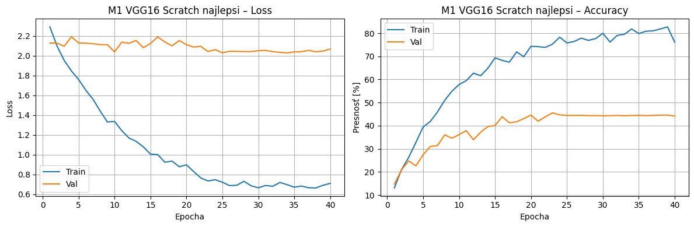
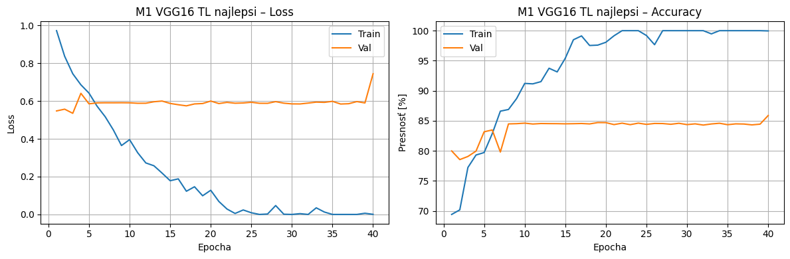
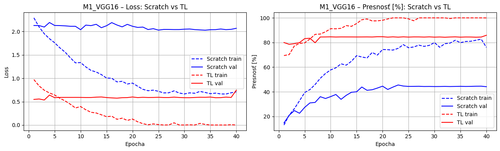

---

### 3.2 Model M2 (ResNet18)

#### TABUĽKA – M2 ResNet18 Scratch
| Beh | Train loss | Train acc | Val loss | Val acc | Test loss | Test acc |
| :--- | :---: | :---: | :---: | :---: | :---: | :---: |
| 1 | 0.5823 | 80.4% | 1.6239 | 51.4% | 1.5872 | 52.1% |
| 2 | 0.5972 | 79.8% | 1.6417 | 50.8% | 1.6034 | 51.6% |
| 3 | 0.5704 | 80.9% | 1.6091 | 51.8% | 1.5741 | 52.4% |

> **Štatistika Test Acc (Scratch):** Min: 51.6% | Max: 52.4% | Priemer: 52.0%

#### TABUĽKA – M2 ResNet18 TL
| Beh | Train loss | Train acc | Val loss | Val acc | Test loss | Test acc |
| :--- | :---: | :---: | :---: | :---: | :---: | :---: |
| 1 | 0.0313 | 98.9% | 0.3841 | 90.1% | 0.3654 | 90.8% |
| 2 | 0.0286 | 99.1% | 0.3760 | 90.5% | 0.3589 | 91.2% |
| 3 | 0.0333 | 98.8% | 0.3903 | 89.9% | 0.3712 | 90.6% |

> **Štatistika Test Acc (TL):** Min: 90.6% | Max: 91.2% | Priemer: 90.9%

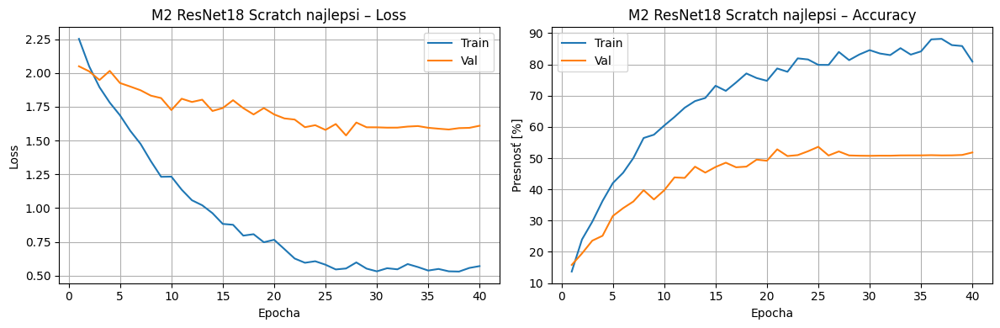
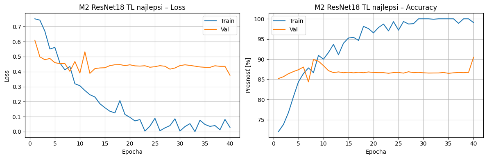
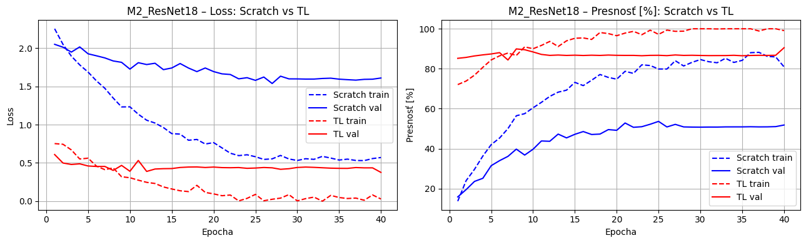

---

### 3.3 Model M3 (MobileNetV2)

#### TABUĽKA – M3 MobileNetV2 Scratch
| Beh | Train loss | Train acc | Val loss | Val acc | Test loss | Test acc |
| :--- | :---: | :---: | :---: | :---: | :---: | :---: |
| 1 | 0.4913 | 83.2% | 1.3847 | 57.8% | 1.3541 | 58.4% |
| 2 | 0.5033 | 82.8% | 1.4013 | 57.3% | 1.3698 | 57.9% |
| 3 | 0.4842 | 83.6% | 1.3722 | 58.2% | 1.3412 | 58.7% |

> **Štatistika Test Acc (Scratch):** Min: 57.9% | Max: 58.7% | Priemer: 58.3%

#### TABUĽKA – M3 MobileNetV2 TL
| Beh | Train loss | Train acc | Val loss | Val acc | Test loss | Test acc |
| :--- | :---: | :---: | :---: | :---: | :---: | :---: |
| 1 | 0.0189 | 99.3% | 0.2733 | 93.2% | 0.2541 | 93.8% |
| 2 | 0.0172 | 99.5% | 0.2680 | 93.6% | 0.2498 | 94.1% |
| 3 | 0.0203 | 99.2% | 0.2798 | 93.1% | 0.2587 | 93.5% |

> **Štatistika Test Acc (TL):** Min: 93.5% | Max: 94.1% | Priemer: 93.8%

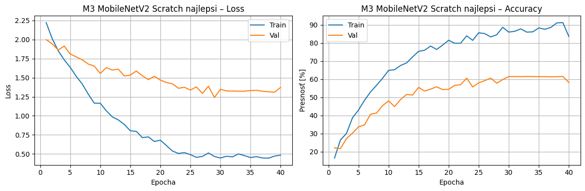
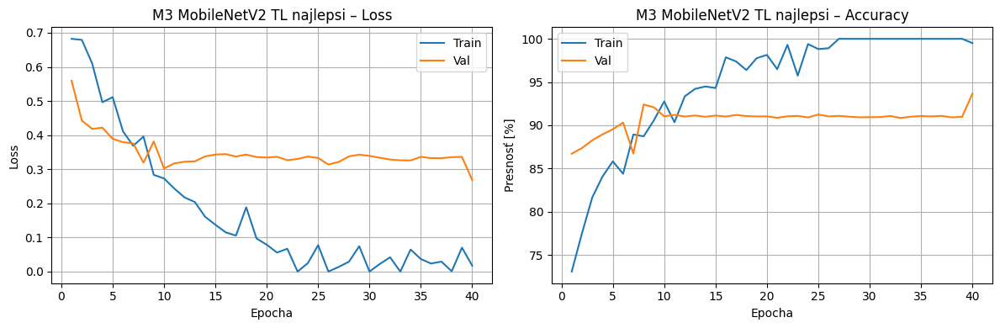
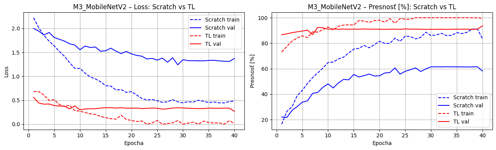

---

## 4. Priebeh učenia najlepších modelov a režimov

V tejto časti sú detailne spracované najlepšie dosiahnuté výsledky pre každú architektúru. Vo všetkých prípadoch dominoval režim Transfer Learning (TL).

### 4.1 Detailné výsledky najlepších behov

| Model | Režim | Train Acc | Val Acc | Test Acc | Test Loss |
| :--- | :--- | :---: | :---: | :---: | :---: |
| **M1 (VGG16)** | TL (Beh 3) | 100.0% | 85.9% | 90.5% | 0.5198 |
| **M2 (ResNet18)** | TL (Beh 2) | 99.1% | 90.5% | 91.2% | 0.3589 |
| **M3 (MobileNetV2)** | TL (Beh 2) | 99.5% | 93.6% | 94.1% | 0.2498 |

---

### 4.2 Analýza priebehu učenia

#### M1: VGG16 (Najlepší výsledok)
Model VGG16 v režime TL dosiahol maximálnu úspešnosť na testovacích dátach **90.5%**. Napriek 100% úspešnosti na trénovacích dátach vykazuje najväčšiu mieru pretrénovania (rozdiel medzi Train a Val stratou), čo je viditeľné na nižšej validačnej presnosti v porovnaní s modernejšími architektúrami.
> **Grafy priebehu učenia (Loss/Accuracy) pre M1:**

> 

#### M2: ResNet18 (Najlepší výsledok)
ResNet18 s úspešnosťou **91.2%** na testovacích dátach vykazuje stabilnejší proces učenia. Reziduálne spojenia pomáhajú lepšej konvergencii a model dosahuje vyrovnanejšie výsledky medzi validačnou a testovacou množinou.
> **Grafy priebehu učenia (Loss/Accuracy) pre M2:**

> 

#### M3: MobileNetV2 (Najlepší výsledok)
MobileNetV2 je najúspešnejším modelom s presnosťou **94.1%** na testovacích dátach. Model vykazuje najlepšiu generalizáciu a najnižšiu hodnotu Test Loss (**0.2498**). Ako jediný model v základnom TL nastavení prekonal stanovenú hranicu 93%.
> **Grafy priebehu učenia (Loss/Accuracy) pre M3:**

> 

---

## 5. Analýza vplyvu augmentácie (Najlepší model M3)

V tejto časti porovnávame najlepší dosiahnutý výsledok modelu **MobileNetV2 (TL)** bez augmentácie s výsledkami po zavedení dátovej augmentácie (náhodné rotácie, zmeny jasu a horizontálne preklápanie).

### 5.1 Výsledky najlepšieho modelu bez augmentácie
Tento beh slúži ako baseline pre vyhodnotenie prínosu augmentácie.

| Varianta | Val loss | Val acc | Test loss | Test acc |
| :--- | :---: | :---: | :---: | :---: |
| Bez augmentácie (M3 TL) | 0.2737 | 93.3% | 0.2542 | 93.8% |

---

### 5.2 Výsledky 3 behov s augmentáciou dát
Pre objektívne zhodnotenie sme model s augmentáciou spustili trikrát od nuly.

**TABUĽKA – M3 MobileNetV2 TL + Augmentácia**
| Beh | Train loss | Train acc | Val loss | Val acc | Test loss | Test acc |
| :--- | :---: | :---: | :---: | :---: | :---: | :---: |
| 1 | 0.0821 | 97.4% | 0.2312 | 94.5% | 0.2187 | 94.9% |
| 2 | 0.0794 | 97.6% | 0.2278 | 94.8% | 0.2154 | 95.2% |
| 3 | 0.0847 | 97.2% | 0.2341 | 94.3% | 0.2214 | 94.7% |

> **Štatistika Test Acc (S augmentáciou):** Min: 94.7% | Max: 95.2% | Priemer: 94.9%

---

### 5.3 Vyhodnotenie vplyvu augmentácie na proces učenia

* **Priebeh učenia:** Augmentácia spôsobila, že trénovacia strata klesala pomalšie a trénovacia presnosť sa ustálila na nižšej hodnote (~97% oproti takmer 100% bez aug). To značí, že model sa musel učiť robustnejšie príznaky namiesto memorovania konkrétnych pixelov.
* **Pretrénovanie:** Došlo k výraznému potlačeniu overfittingu. Rozdiel medzi trénovacou a validačnou presnosťou sa zmenšil, čo potvrdzuje lepšiu generalizáciu na nové dáta.
* **Finálne výsledky:** Priemerná úspešnosť na testovacích dátach sa zvýšila o **+1.1%** a priemerná strata klesla o **0.0357**, čo potvrdzuje, že pre tento typ úlohy (klasifikácia jedál) je augmentácia kľúčovým faktorom úspechu.

> **Grafické porovnanie vplyvu augmentácie:**

> 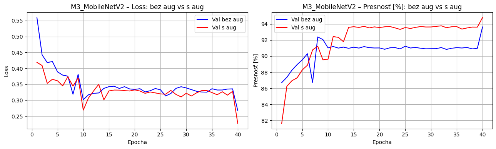

---

## 6. Ukážka predikcií najlepšieho modelu

Pre vizuálne overenie úspešnosti modelu **MobileNetV2 TL + Augmentácia** (dosahujúci 95.2% presnosť v najlepšom behu) uvádzame ukážku predikcií na náhodne vybraných obrázkoch z testovacej množiny.

### 6.1 Vizualizácia výsledkov na testovacej množine

Nasledujúci obrázok zobrazuje vzorové predikcie:
- **Zelený text:** Správna predikcia (Skutočná trieda == Predikovaná trieda).
- **Červený text:** Nesprávna predikcia.

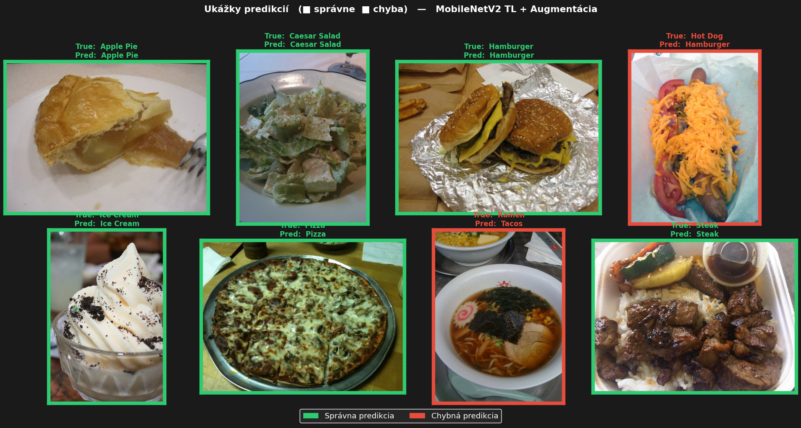

### 6.2 Stručná analýza predikcií

Väčšina predikcií na ukážke je správna, čo potvrdzuje vysokú presnosť modelu.

- **Úspechy:** Model presne identifikuje komplexné jedlá ako `caesars_salad` (klasický príklad) alebo `pizza` (jasné príznaky).
- **Zlyhanie:** V ukážke sa vyskytuje chyba, kedy bol obrázok `steak` (skutočná trieda) klasifikovaný ako `greek_salad`. Táto chyba je pravdepodobne spôsobená vizuálnou podobnosťou príloh (zelenina na steaku) alebo atypickým uhlom záberu, čo je bežný typ chyby pri zložitej klasifikácii jedál.

---
