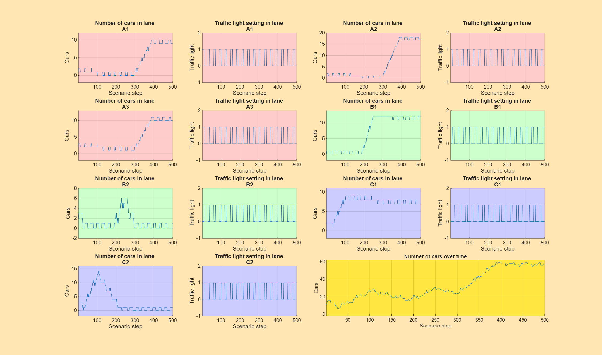
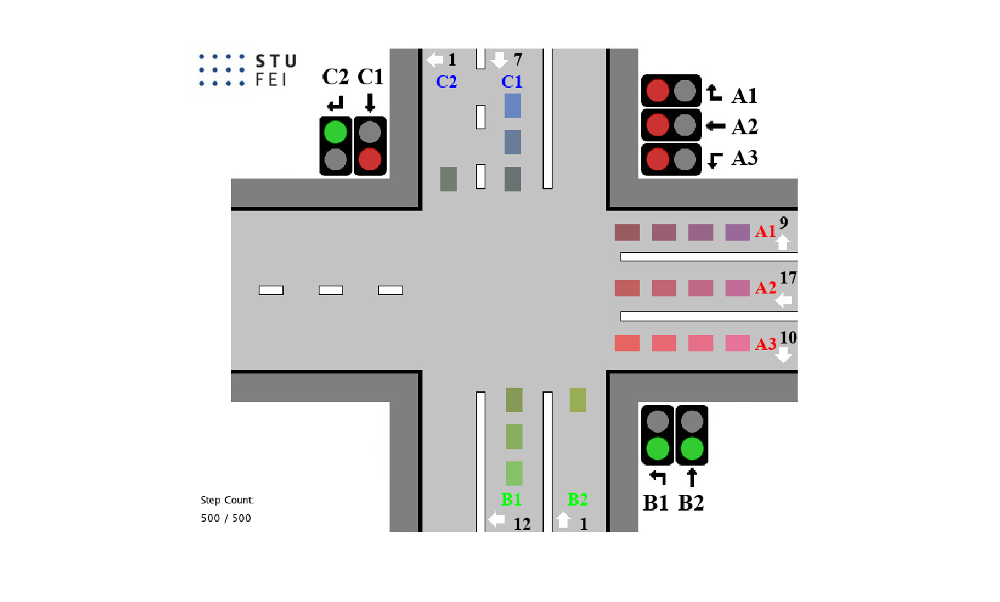
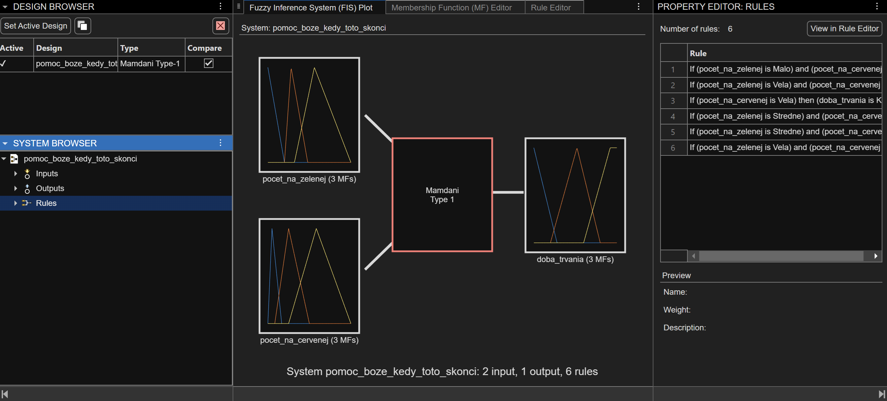
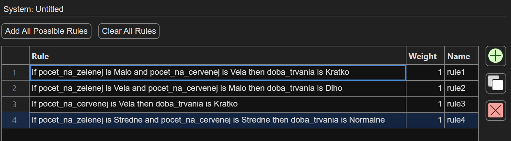
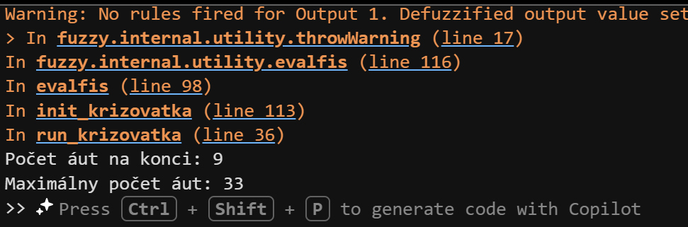
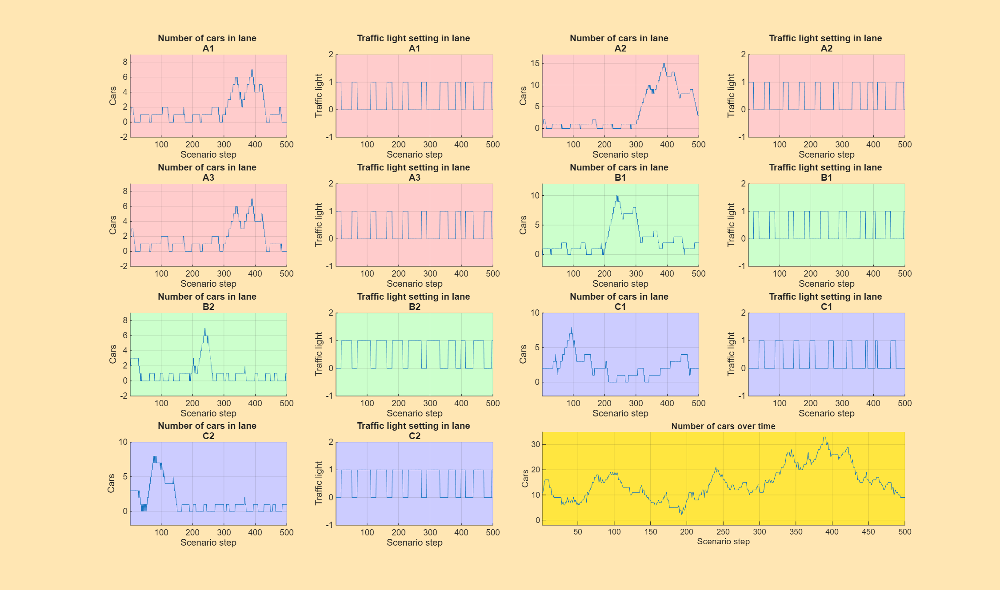
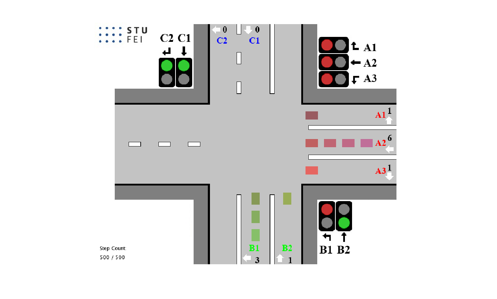

# Riadenie križovatky pomocou fuzzy logiky (Zadanie č. 9)

# 1. Opis úlohy a princíp riadenia
Cieľom úlohy je navrhnúť adaptívne riadenie križovatky pomocou fuzzy logiky a porovnať ho s riadením pomocou pevných časových intervalov. Systém modeluje križovatku so 7 pruhmi a dynamicky upravuje dĺžku zelenej fázy podľa aktuálnej hustoty premávky na vstupe.

# 2. Konfigurácie semaforov a režimy testovania
Semafor cyklicky strieda tri konfigurácie:
1. Konfigurácia 1: [A1, A2, A3]
2. Konfigurácia 2: [B1, B2, C2]
3. Konfigurácia 3: [B2, C1, C2]

Testovanie prebiehalo v režimoch 1 až 6, pričom Režim 6 predstavuje kombinovanú dopravnú špičku a slúži na finálne overenie limitov.

# 3. Pevné riadenie (Referenčné hodnoty)
Pre porovnanie bolo najskôr otestované pevné riadenie s vektorom dĺžok fáz intervaly = [10 10 10].
- vlastne_intervaly: 1
- fuzzy_volba: 0

## 3.1
Nižšie je zobrazenie bez pridania fuzzy logiky v režime 6:

# 4. Návrh Fuzzy systému (Mamdani)
Navrhnutý systém využíva dva vstupy a jeden výstup.

## Vstupy a Výstup
- Vstup 1 (pocet_na_zelenej): Celkový počet áut v pruhoch, ktoré majú aktuálne zelenú (rozsah 0-25).
- Vstup 2 (pocet_na_cervenej): Celkový počet áut čakajúcich na červenú v ostatných smeroch (rozsah 0-60).
- Výstup (doba_trvania): Doba trvania momentálnej konfigurácie (rozsah 5-30).

### Pravidlá (Rules)
Logika pravidiel je nastavená tak, aby uprednostnila smery s kritickým počtom áut:
1. Ak je na zelenej Vela a na červenej Malo -> Doba trvania je Dlho.
2. Ak je na červenej Kriticky -> Doba trvania je Kratko (rýchle prepnutie pre čakajúcich).
3. Ak je na zelenej Malo a na červenej Vela -> Doba trvania je Kratko.
4. Ak je na zelenej stredne a na červenej stredne -> Doba trvania je Stredne 
5. Ak je na zelenej stredne a na červenej veľa -> Doba trvania je Kratko
6. Ak je na zelenej Veľa a na červenej stredne -> Doba trvania je Dlho

## 5. Nastavenie premenných programu
V hlavnom skripte run_krizovatka.m boli pre spustenie fuzzy riadenia nastavené tieto hodnoty:
- fuzzy_volba = 1
- vlastne_intervaly = 0
- fuzzy_meno = 'pomoc_boze_kedy_toto_skonci.fis'

## 6. Porovnanie výsledkov a splnenie limitov (Režim 6)
Fuzzy riadenie v režime 6 dosiahlo nasledujúce výsledky oproti stanoveným limitom:

| Parameter | Požadovaný limit | Dosiahnutý výsledok |
| :--- | :--- | :--- |
| Max. počet áut v pruhu A2 | 15 áut | 3 |
| Max. počet v ostatných pruhoch | 10 áut | 10 |
| Max. počet čakajúcich celkovo | 40 áut | 33 |
| Počet čakajúcich na konci | < 20 áut | 9 |

## 7. Grafické vyhodnotenie a vizualizácia

### Priebeh počtu čakajúcich áut
Nižšie je zobrazený graf vývoja počtu čakajúcich áut v jednotlivých pruhoch počas simulácie v Režime 6. Je vidieť, že fuzzy logika úspešne drží hodnoty pod stanoveným limitom.

### Finálny stav križovatky
Simulácia križovatky na konci scenára:

### Diskusia
Fuzzy riadenie preukázalo výrazne vyššiu efektivitu pri riešení dopravných špičiek. Na rozdiel od pevných intervalov systém neplytval časom na prázdnych pruhoch a dynamicky uvoľňoval najviac zaťažené smery. Metóda výpočtu ťažiska (centroid) pri defuzzifikácii zabezpečila plynulé zmeny intervalov, čo prispelo k celkovej plynulosti simulácie.